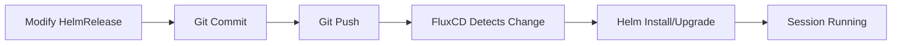

# FluxCD Deployment for Dozlab Sessions

This directory contains FluxCD manifests for GitOps-based deployment of Dozlab lab sessions.

## Overview

FluxCD provides:
- **Automated deployments** from Git commits
- **Declarative configuration** for lab sessions
- **Version control** for all session configurations
- **Multi-session management** with separate HelmRelease resources

## Directory Structure

```
fluxcd/
├── base/
│   └── gitrepository.yaml       # Git source configuration
└── sessions/
    ├── kustomization.yaml       # FluxCD Kustomization
    └── example-session.yaml     # Example HelmRelease
```

## Prerequisites

### 1. FluxCD Installation

Install FluxCD in your Kubernetes cluster:

```bash
# Install Flux CLI
curl -s https://fluxcd.io/install.sh | sudo bash

# Bootstrap Flux with your Git repository
flux bootstrap github \
  --owner=DozLab \
  --repository=dozlab-infra \
  --branch=main \
  --path=fluxcd \
  --personal
```

### 2. Repository Configuration

Update `fluxcd/base/gitrepository.yaml` with your repository URL:

```yaml
spec:
  url: https://github.com/YourOrg/your-repo
  ref:
    branch: main
```

For private repositories, create a secret:

```bash
flux create secret git git-credentials \
  --url=https://github.com/YourOrg/your-repo \
  --username=git \
  --password=<your-github-token>
```

Then uncomment the `secretRef` in `gitrepository.yaml`.

## Quick Start

### 1. Apply Base Configuration

```bash
# Apply GitRepository
kubectl apply -f fluxcd/base/gitrepository.yaml

# Verify source is ready
flux get sources git
```

### 2. Create a Lab Session

Create a new HelmRelease file in `fluxcd/sessions/`:

```yaml
# fluxcd/sessions/my-session.yaml
---
apiVersion: helm.toolkit.fluxcd.io/v2
kind: HelmRelease
metadata:
  name: lab-session-my-session
  namespace: default
spec:
  interval: 5m
  chart:
    spec:
      chart: charts/dozlab-session
      sourceRef:
        kind: GitRepository
        name: dozlab-infra
        namespace: flux-system
  values:
    session:
      id: "my-session-001"
      userId: "alice"
    rootfs:
      imageUrl: "https://storage.googleapis.com/your-bucket/dozlab-k8s.ext4"
    codeServer:
      password: "CHANGE-ME"  # Generate: openssl rand -base64 32
```

### 3. Commit and Push

```bash
git add fluxcd/sessions/my-session.yaml
git commit -m "Add lab session for Alice"
git push
```

FluxCD will automatically detect the change and deploy the session within 1-5 minutes.

### 4. Monitor Deployment

```bash
# Watch HelmReleases
flux get helmreleases -w

# Check specific session
flux get helmrelease lab-session-my-session

# View reconciliation logs
flux logs --follow --level=info
```

## Session Management

### Creating Multiple Sessions

Each user/session should have a separate HelmRelease file:

```
fluxcd/sessions/
├── session-alice-001.yaml
├── session-bob-002.yaml
├── session-charlie-003.yaml
└── kustomization.yaml
```

### Session Configuration Template

```yaml
---
apiVersion: helm.toolkit.fluxcd.io/v2
kind: HelmRelease
metadata:
  name: lab-session-<UNIQUE-NAME>
  namespace: default  # or dedicated namespace
spec:
  interval: 5m
  chart:
    spec:
      chart: charts/dozlab-session
      sourceRef:
        kind: GitRepository
        name: dozlab-infra
        namespace: flux-system
      interval: 1m

  # Automatic upgrades
  upgrade:
    remediation:
      retries: 3

  # Session-specific values
  values:
    session:
      id: "<unique-session-id>"
      userId: "<user-id>"

    rootfs:
      imageUrl: "https://example.com/dozlab-k8s.ext4"
      diskSize: "4G"

    firecracker:
      vm:
        cpuCount: "2"
        memory: "2048"
      resources:
        limits:
          memory: "3Gi"
          cpu: "2000m"

    codeServer:
      password: "<secure-password>"
      workspaceReadOnly: false

    volumes:
      vmData:
        sizeLimit: "10Gi"

  timeout: 10m
```

### Updating a Session

Modify the HelmRelease file and commit:

```bash
# Edit session configuration
vim fluxcd/sessions/session-alice-001.yaml

# Commit changes
git add fluxcd/sessions/session-alice-001.yaml
git commit -m "Update Alice's session: increase memory to 4GB"
git push

# Force immediate reconciliation (optional)
flux reconcile helmrelease lab-session-alice-001
```

### Deleting a Session

Remove the HelmRelease file:

```bash
git rm fluxcd/sessions/session-alice-001.yaml
git commit -m "Remove Alice's session"
git push
```

FluxCD will automatically delete the resources.

## Advanced Configuration

### Using Different Rootfs Images per Session

```yaml
values:
  rootfs:
    # Kubernetes-focused lab
    imageUrl: "https://example.com/dozlab-k8s.ext4"

    # Or Docker-focused lab
    # imageUrl: "https://example.com/dozlab-docker.ext4"
```

### Resource Quotas per Session

```yaml
values:
  firecracker:
    vm:
      cpuCount: "1"     # Light session
      memory: "1024"

  volumes:
    vmData:
      sizeLimit: "5Gi"  # Limit disk usage
```

### Session Labels for Organization

```yaml
values:
  labels:
    team: "platform-engineering"
    course: "kubernetes-101"
    cohort: "2024-spring"
    instructor: "alice"
```

## Monitoring and Observability

### Check All Sessions

```bash
# List all HelmReleases
flux get helmreleases -A

# List all Pods from sessions
kubectl get pods -l app=lab-environment
```

### Session Health Checks

```bash
# Check specific session health
kubectl get pod -l session-id=my-session-001
kubectl describe pod -l session-id=my-session-001

# View Firecracker VM logs
kubectl logs -l session-id=my-session-001 -c firecracker-vm --tail=100
```

### FluxCD Alerts (Optional)

Configure alerts for deployment failures:

```yaml
---
apiVersion: notification.toolkit.fluxcd.io/v1beta1
kind: Alert
metadata:
  name: dozlab-sessions-alert
  namespace: flux-system
spec:
  providerRef:
    name: slack
  eventSeverity: error
  eventSources:
    - kind: HelmRelease
      name: '*'
      namespace: default
```

## Troubleshooting

### HelmRelease Not Deploying

```bash
# Check HelmRelease status
flux get helmrelease lab-session-my-session

# View detailed events
kubectl describe helmrelease lab-session-my-session -n default

# Check source readiness
flux get sources git dozlab-infra
```

### Chart Not Found

```bash
# Verify GitRepository is synced
flux get sources git dozlab-infra

# Force reconciliation
flux reconcile source git dozlab-infra
```

### Session Stuck in Pending

```bash
# Check pod events
kubectl describe pod lab-session-<SESSION_ID>

# Check init containers
kubectl logs lab-session-<SESSION_ID> -c init-rootfs
kubectl logs lab-session-<SESSION_ID> -c network-setup
```

### Force Reconciliation

```bash
# Force immediate sync from Git
flux reconcile source git dozlab-infra

# Force HelmRelease update
flux reconcile helmrelease lab-session-my-session
```

## Security Best Practices

1. **Secrets Management**: Use Sealed Secrets or SOPS for VS Code passwords:

```bash
# Example with Sealed Secrets
echo -n "my-secure-password" | \
  kubectl create secret generic vscode-password-alice \
  --dry-run=client \
  --from-file=password=/dev/stdin \
  -o yaml | \
  kubeseal -o yaml > sealed-secret.yaml
```

2. **RBAC**: Limit who can modify HelmReleases
3. **Namespace Isolation**: Deploy sessions in user-specific namespaces
4. **Resource Quotas**: Apply namespace-level quotas to prevent resource exhaustion

## GitOps Workflow



## Migration from Manual Helm

If you have existing Helm releases:

```bash
# List current releases
helm list

# Export current values
helm get values my-lab-session > session-values.yaml

# Create HelmRelease manifest
cat > fluxcd/sessions/migrated-session.yaml <<EOF
apiVersion: helm.toolkit.fluxcd.io/v2
kind: HelmRelease
metadata:
  name: my-lab-session
spec:
  # ... configuration ...
  values:
    # Paste exported values here
EOF

# Uninstall Helm release (FluxCD will adopt resources)
helm uninstall my-lab-session
```

## Resources

- [FluxCD Documentation](https://fluxcd.io/docs/)
- [Helm Controller Guide](https://fluxcd.io/docs/components/helm/)
- [Dozlab Helm Chart README](../charts/dozlab-session/README.md)

## Contributing

For issues and contributions, see the [main repository](https://github.com/DozLab/dozlab-infra).
